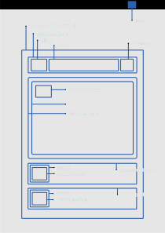

# Theming gTile

Before theming, follow the [developing instructions](README.md) to set up the build environment.

## CSS Architecture

The stylesheet uses a three-layer architecture:

1. **Base/Common styles** — shared by all themes (layout, spacing, border-radius, font sizes). Written with plain class selectors (e.g. `.gtile-tile-table`).
2. **Icon theme layer** — maps CSS classes to icon URLs (light or dark variants). Uses plain class selectors (e.g. `.gtile-close`, `.gtile-action-button--auto-close`).
3. **Theme-specific overrides** — scoped with descendant selectors relative to the overlay root.

### Selector scoping

There are three types of themed elements, each with a different selector pattern:

**Overlay root** — compound selector prevents overlay-specific styles from leaking onto non-overlay actors that also carry the theme class:
```css
.gtile-overlay.gtile-default { background-color: ...; }
```

**Overlay children** — descendant selector scoped to the overlay root:
```css
.gtile-default .gtile-tile-table-item { background-color: ...; }
```

**Preview and grid line actors** (`gtile-preview`, `gtile-grid-lines-preview`) — these are standalone chrome actors that also receive the theme class. The base layer sets their colors as defaults (matching the dark palette). If your theme needs different colors for these, use a compound selector directly on the element:
```css
.gtile-preview.gtile-my-theme { border-color: ...; box-shadow: ...; }
.gtile-preview.gtile-my-theme:activate { background-color: ...; border-color: ...; }
.gtile-grid-lines-preview.gtile-my-theme { border-color: ...; }
```

### Relative units (em)

All dimensions are in `em`, relative to the overlay root `font-size`. This means every size in the UI scales from a single value — the base font size — which is controlled by the `base-font-size` GSettings key (default: 16px) and multiplied by GNOME's `text-scaling-factor`.

Do not use `px` for any dimension. Use `em` fractions (e.g. `0.125em` instead of `2px` at 16px base).

### Extension anatomy



---

## Adding a new theme

### 1. Register the theme in GSettings

Add the CSS class name to the `themes` array in the schema:

```xml
<!-- dist/schemas/org.gnome.shell.extensions.gtile.gschema.xml -->
<key type="as" name="themes">
  <default>['gtile-default', 'gtile-classic', 'gtile-minimal-dark', 'gtile-minimal-light', 'gtile-my-theme']</default>
</key>
```

Theme values in GSettings are **CSS class names** (e.g. `gtile-my-theme`). The preferences UI converts them to human-readable labels automatically via `themeLabel()`:

```
"gtile-my-theme" → "My Theme"
```

The conversion rule: strip the `gtile-` prefix, replace `-` with spaces, capitalize each word.

### 2. Add CSS in the stylesheet

In `dist/stylesheet.css`, add a section under layer 3 (theme-specific styles):

```css
/* MY THEME */
.gtile-overlay.gtile-my-theme {
    background-color: ...;
    box-shadow: ...;
}

.gtile-my-theme .gtile-title-container { ... }
.gtile-my-theme .gtile-title { ... }
.gtile-my-theme .gtile-close, .gtile-my-theme .gtile-settings { ... }
.gtile-my-theme .gtile-tile-table-item { ... }
.gtile-my-theme .gtile-tile-table-item:activate { ... }
.gtile-my-theme .gtile-preset-button { ... }
.gtile-my-theme .gtile-action-button { ... }
```

If your theme needs different preview/grid line colors than the base defaults (e.g. a light-background theme), see the selector scoping section above.

If your theme uses light icons instead of the default (light icons on dark backgrounds), override the icon layer:

```css
/* Override to dark icons (for light backgrounds) */
.gtile-my-theme .gtile-close {
    background-image: url("images/icons/dark/32/close.png");
}
/* ... repeat for other icons ... */
```

Do **not** redeclare base properties (dimensions, spacing, border-radius) — those are inherited from layer 1. Only override colors, backgrounds, and other visual properties.

### 3. Build and install

```shell
npm run build:dist
npm run install:extension
```

Then reload GNOME Shell: `Alt`+`F2`, type `r`, Enter.

The theme switch in preferences applies **immediately** (hot-reload) — no restart required.

---

## Adding a new icon

Icons are referenced from `dist/images/icons/` and must be provided in three raster resolutions plus an SVG source:

```
dist/images/icons/
├── light/          # light-colored icons (for dark-background themes)
│   ├── 16/
│   ├── 32/
│   ├── 48/
│   └── source/     # SVG originals
└── dark/           # dark-colored icons (for light-background themes)
    ├── 16/
    ├── 32/
    ├── 48/
    └── source/
```

The stylesheet references the `32/` resolution. Other resolutions may be used by future scaling logic.

### Auto-generating raster files from SVG

If inkscape is installed, the auto-generate script exports all three resolutions automatically:

```shell
cd dist/images
./auto-generate.sh
```

Place your SVG source in `dist/images/icons/[light|dark]/source/` before running the script.

### Wiring the icon to a CSS class

After adding the files, reference them in the icon theme layer (section 2) of `dist/stylesheet.css`:

```css
/* Base icon (light variant, used by default) */
.gtile-my-button {
    background-image: url("images/icons/light/32/my-icon.png");
}
```

If the button needs a dark variant for light-background themes, add an override in the relevant theme section:

```css
.gtile-my-theme .gtile-my-button {
    background-image: url("images/icons/dark/32/my-icon.png");
}
```
