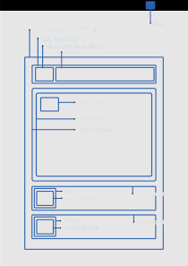

# Theming HyprWM

Before the theming, before you must the follow developing instructions.

## Adding new theme

Add your theme name into [the schema](dist/schemas/org.gnome.shell.extensions.hyprwm.gschema.xml) under `themes`.

This name is creating your style classes. For example, the new theme name is "Gnome 40"; the plugin applies the following regular expression to the theme name and for this example `[THEME NAME]` is `gnome-40`.

Theme name mangling: `"Gnome 40".toLowerCase().replace(/[^a-z0-9]/g, "-")`

### Extension structure



You can use the above-mentioned class names to style your theme.

You must add `hyprwm-[THEME NAME]__` to the beginning of classes outside the main container.

### Styling the extension

Put your CSS codes into the [stylesheet](./dist/stylesheet.css).

### Install extension

Install extension with npm

```shell
npm run build:dist
npm run install:extension
```

If succeeded, hit `Alt`+`F2`, type `r`, and hit enter.

## Adding new icon

If icons are .svg format supports automatically create an export 3 resolution of the icon. (Requires [inkscape](https://inkscape.org/))

1. Add your icons into the `dist/images/icons/[THEME]/source`.

2. Run auto generate

  ```shell
  cd images
  ./auto-generate.sh
  ```
